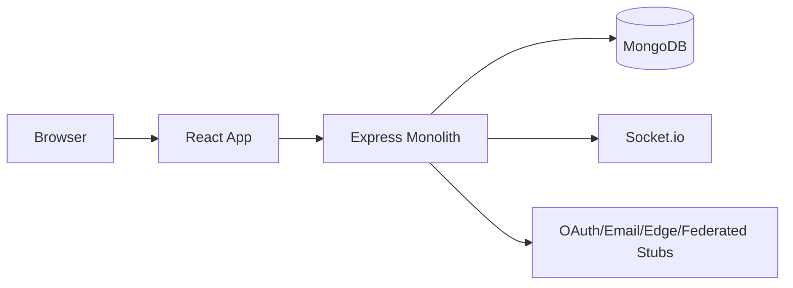

# PrivacyVault AI

Privacy-first multimodal SaaS monolith designed for fast shipping today and clean microservice extraction tomorrow.

## Stack

- Frontend: React 18, Vite, Tailwind, Redux Toolkit, Socket.io client
- Backend: Node.js, Express, MongoDB/Mongoose, Socket.io, Passport OAuth, TOTP MFA
- Shared: Contracts and constants in `/shared`
- DevOps: Docker, docker-compose, Kubernetes manifests, GitHub Actions

## Repository Layout

```text
privacyvault-ai/
  backend/
  frontend/
  shared/
  docs/
  k8s/
  .github/workflows/ci.yml
  Dockerfile
  docker-compose.yml
```

## Quick Start (Local)

1. Install dependencies:

```bash
npm ci
```

2. Copy environment template:

```bash
cp .env.example .env
```

3. Start MongoDB (local Docker):

```bash
docker compose up -d mongo
```

4. Seed demo data:

```bash
npm run seed
```

5. Start backend + frontend:

```bash
npm run dev
```

6. Open app:

- Frontend: `http://localhost:5173`
- API docs: `http://localhost:8080/api/docs`

## Auth Configuration

Configure `.env` values:

- `GOOGLE_CLIENT_ID`, `GOOGLE_CLIENT_SECRET`, `GOOGLE_CALLBACK_URL`
- `GITHUB_CLIENT_ID`, `GITHUB_CLIENT_SECRET`, `GITHUB_CALLBACK_URL`
- `FOUNDER_EMAIL` for admin access

Fallback path works with magic links in local development.

## Tests

```bash
npm run test
npm run e2e
```

## Docker

```bash
docker compose up --build
```

## Kubernetes

```bash
kubectl apply -f k8s/monolith-configmap.yaml
kubectl apply -f k8s/monolith-deployment.yaml
kubectl apply -f k8s/monolith-service.yaml
kubectl apply -f k8s/ingress.yaml
kubectl apply -f k8s/hpa.yaml
```

Future split examples:

```bash
kubectl apply -f k8s/auth-service-split.yaml
kubectl apply -f k8s/core-service-split.yaml
```

## Security Highlights

- JWT access + rotating refresh tokens
- Refresh revocation list
- CSRF token strategy for cookie-sensitive endpoints
- Rate limiting, validation, secure headers
- Encrypted integration credentials
- Audit logging and irreversible reset flow

## Privacy Commitments

- No training on user data
- Export and delete controls
- Vault-level data isolation
- Transparent audit trail

## Architecture Diagram



## Scale Path to 1M Users

- Vault-keyed partition strategy
- Socket room scoping by vault
- Caching + queue abstractions prepared for Redis/Kafka
- Pagination + indexed queries throughout
- Kubernetes HPA and split-ready manifests

## Known Limitations

- AI/image/speech providers are mocked by default.
- OAuth requires real provider credentials.
- Advanced collaboration cryptography is an approximation stub, not full ZKP implementation.

## Immediate Hardening Tasks

1. Replace all mock providers with audited managed services.
2. Add SAST/DAST + dependency audit in CI.
3. Introduce Redis for distributed sessions/rate limits/cache.
4. Add key-management integration (KMS/HSM).
5. Implement tenant-aware observability dashboards and alerting.
