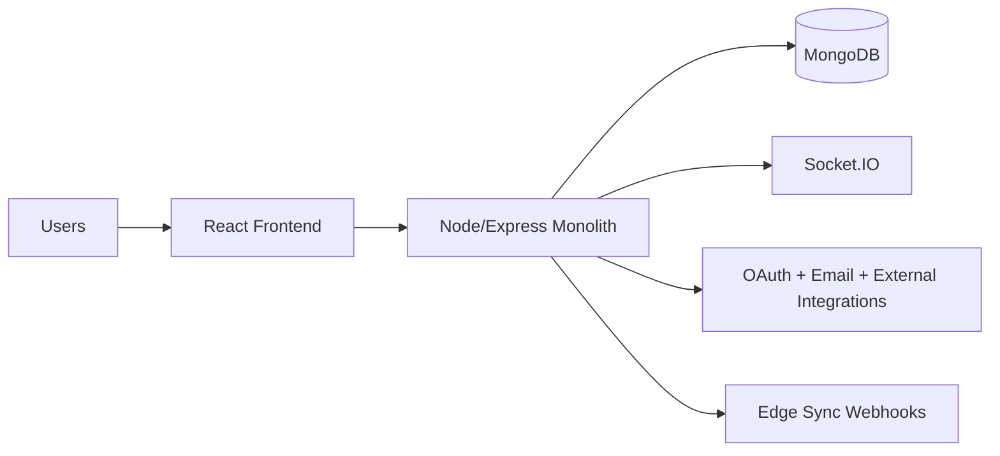
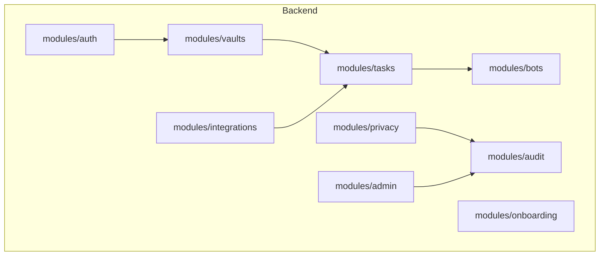
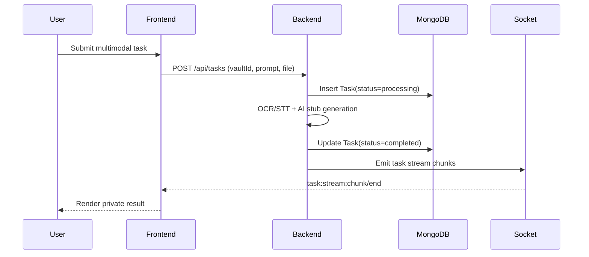

# Architecture

PrivacyVault AI ships as a modular monolith with explicit extraction seams for auth, core multimodal runtime, analytics, and admin domains.

## System Context

## Module Boundaries

## Request Flows

## Scale Notes

- Vault isolation uses `vaultId` scoping on all domain entities.
- `Vault.shardKey` exists for future Mongo sharding.
- Socket rooms are scoped by vault.
- Event bus and cache abstractions are in place for Redis/Kafka extraction.
